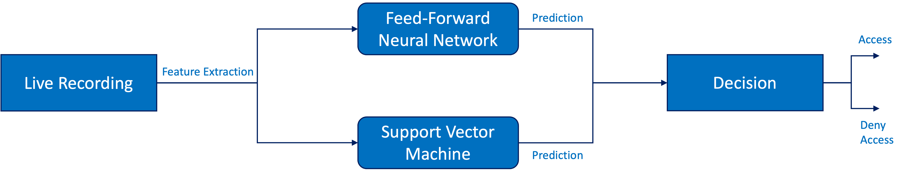
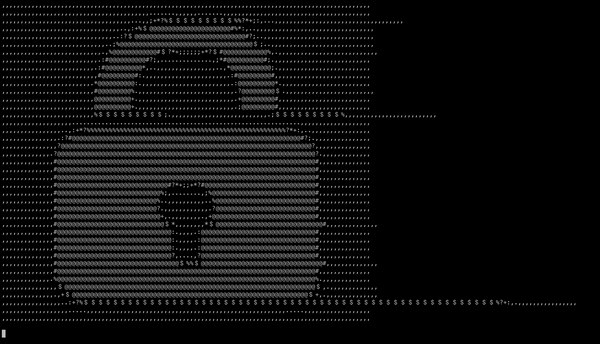

# **OpenSesame**
## **The speaker recognition system, that keeps the integrity of your data!**


OpenSesame is a software for speaker identification and speach recognition system. It leverages a Neural Network and a Support Vector Machine to identify if the correct speaker said the correct keyword, such as "open sesame". After detecting the speaker and the key word, the program is to unlock the data, lock, or whatever is connected to the software.

### **How does OpenSesame work?**
OpenSesame consists of 4 parts: 1) live recording, 2) NN, 3) SVM, and 4) the decision block, as shown in Fig. 1. In the following, we will shortly introduce the main components of the program.



1) Live Recording: OpenSesame records live data to identify if the keyword has been said by the correct user in real time. The recordings are saves in three wave files, that overlap to catch the case if the keyword is split onto two different recordings. The prediction is then run over the three recordings.

2) NN: The neural network computes a prediction value of between 0 and 1. If it surpasses the threshold of 0.6, the system recognises that the correct speaker said the correct keyword.

3) SVM: The SVM computes a prediction value of between 0 and 1. If it surpasses the threshold of 0.75, the system recognises that the correct speaker said the correct keyword.

4) Decision: If both thresholds of the NN and the SVM are supassed, then and only then the system unlocks. Using two different models, gives us a kind of fail-safe, for the case that the NN or the SVM somehow predicts a high value, eventhoug it should not have. The unlock screen, as shown in Fig. 2 will appear.



### **Machine Learning Models**

#### **Neural Network Archtecture**
The Neural Network used for OpenSesame is a Feed-Forward neural network, that implents 6 Dense layers. The first layer expands the feature vector from 40 to 256 dimensions. Every following layer decreases the dimensionality by a power of 2, namely 128, 64, 32, 16, 1. All layers use a Relu activation function, except the last layer. It uses a Sigmoid activation, which gives us a value that represents a probability (bewteen 0 and 1) if the correct speaker said the correct keyword.

#### **Support Vector Machine**

#### **Training Data**
For training we collected 136 recordings, which is split into 50% positive and 50% negative samples. Each recording is split into 197 vectors, which are fed to the model during training. For testing our model, we use the exact same strateg as for training.


|   | Recordings for Training | Recordings for Testing |
| ------------- | ------------- | ------------- |
| Positive  | 78  | 17 |
| Negative  | 78  | 17 |
| Total  | 156  | 34 |


### **Project Structure**

```
├── Archive
├── README.md
├── data
│   ├── live
│   ├── test
│   └── train
├── images
├── requirements.txt
└── src
    ├── main.py
    └── utils
        ├── __init__.py
        ├── closed_lock.txt
        ├── im2a.py
        ├── open_lock.txt
        ├── preprocess_data.py
        └── record.py
    ├── feed-forward
    │   ├── feed-forward_train.py
    │   ├── models
    │   ├── old
    │   └── plots
    ├── gmm
    │   ├── test_gmm.py
    │   ├── testing_set
    │   ├── train_gmm.py
    │   ├── trained_models
    ├── rnn
    │   ├── models
    │   ├── plots
    │   ├── rnn-validate.py
    │   └── rnn_train.py
    ├── svm
    │   ├── models
    │   ├── old
    │   └── svm_train.py
```

- Main
- Data preprocessing for training
- Training the models


### **Team**

The team behind this project consists of three graudate engineering students, currently enrolled in the EIT Autonomous Systems program at Polytech Nice-Sophia.


1) Filippo Zeggio
2) Philipp Ahrendt
3) Dalim Wahby
