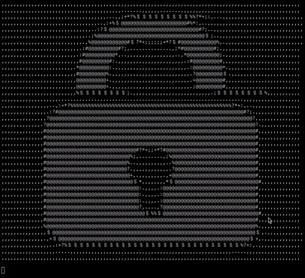

# **OpenSesame**
## **The speaker recognition system, that keeps the integrity of your data!**


OpenSesame is a software for speaker identification and speach recognition system. It leverages a Neural Network and a Support Vector Machine to identify if the correct speaker said the correct keyword, such as "open sesame". After detecting the speaker and the key word, the program is to unlock the data, lock, or whatever is connected to the software.

### **How does OpenSesame work?**
OpenSesame consists of 4 parts: 1) live recording, 2) neural network, 3) support vector machine, and 4) the decision block, as shown in Fig. 1. In the following, we will shortly introduce the main components of the program.


Figure 1: Logic of OpenSesame

1) Live Recording: OpenSesame records live data to identify if the keyword has been said by the correct user in real time. The recordings are saves in three wave files, that overlap to catch the case if the keyword is split onto two different recordings. The prediction is then run over the three recordings.

2) Neural Network (NN): The neural network computes a prediction value of between 0 and 1. If it surpasses the threshold of 0.6, the system recognises that the correct speaker said the correct keyword.

3) Support Vector Machine (SVM): The SVM computes a prediction value of between 0 and 1. If it surpasses the threshold of 0.75, the system recognises that the correct speaker said the correct keyword.

4) Decision: If both thresholds of the NN and the SVM are supassed, then and only then the system unlocks. Using two different models, gives us a kind of fail-safe, for the case that the NN or the SVM somehow predicts a high value, eventhoug it should not have. The unlock screen, as shown in Fig. 2.


Figure 2: Unlock Screen

### **Machine Learning Models**

#### **Neural Network Archtecture**
The Neural Network used for OpenSesame is a Feed-Forward neural network, that implents 6 Dense layers. The first layer expands the feature vector from 40 to 256 dimensions. Every following layer decreases the dimensionality by a power of 2, namely 128, 64, 32, 16, 1. All layers use a Relu activation function, except the last layer. It uses a Sigmoid activation, which gives us a value that represents a probability (bewteen 0 and 1) if the correct speaker said the correct keyword. The model is trained on 40 epochs and the loss and accuarcy functions are displayed in Fig. 3.


Figure 3: Accuracy and Loss of the Training process


Since we unpack every recording into 197 individual vectors, we evaluate the trained model twice. Firstly, how well did the model generalise on all samples and how well did the model generalise on the recodings?

Confusion Matrix for individual samples:

Figure 4: Confusion Matrix of Prediction on all samples

Confusion Matrix for on recordings:

Figure 5: Confusion Matrix of Prediction on all recordings


Performance Metrics on individual samples:


```
Classificaiton Report over all sample vectors:
              precision    recall  f1-score   support

         0.0       0.75      0.79      0.77      3214
         1.0       0.79      0.76      0.78      3484

    accuracy                           0.77      6698
   macro avg       0.77      0.77      0.77      6698
weighted avg       0.77      0.77      0.77      6698
```


Performance Metrics on recordings:

```
Classificaiton Report over all recordings:
              precision    recall  f1-score   support

         0.0       1.00      1.00      1.00        17
         1.0       1.00      1.00      1.00        17

    accuracy                           1.00        34
   macro avg       1.00      1.00      1.00        34
weighted avg       1.00      1.00      1.00        34
```


#### **Support Vector Machine**
The SVM model implements the default ```SVC()``` model provided by the sklearn library, which uses a radial basis function as the kernel.

# TODO

#### **Training Data**
For training we collected 136 recordings, which is split into 50% positive and 50% negative samples. Each recording is split into 197 vectors, which are fed to the model during training. For testing our model, we use the exact same strateg as for training.


|   | Recordings for Training | Recordings for Testing |
| ------------- | ------------- | ------------- |
| Positive  | 78  | 17 |
| Negative  | 78  | 17 |
| Total  | 156  | 34 |


### **Project Structure**

```
├── Archive
├── README.md
├── data
│   ├── live
│   ├── test
│   └── train
├── images
├── requirements.txt
└── src
    ├── main.py
    ├── utils
    │   ├── __init__.py
    │   ├── closed_lock.txt
    │   ├── im2a.py
    │   ├── open_lock.txt
    │   ├── preprocess_data.py
    │   └── record.py
    ├── feed-forward
    │   ├── feed-forward_train.py
    │   ├── models
    │   ├── old
    │   └── plots
    ├── gmm
    │   ├── test_gmm.py
    │   ├── testing_set
    │   ├── train_gmm.py
    │   ├── trained_models
    ├── rnn
    │   ├── models
    │   ├── plots
    │   ├── rnn-validate.py
    │   └── rnn_train.py
    └── svm
        ├── models
        ├── old
        └── svm_train.py
```

All code is stored in the ```./src``` directory. It contains the ```main.py``` file, that contains the actual program, implementing the logic and the used models. Additionally, there are further models (i.e. ```./src/rnn``` ), that were used for training, however were not seen as feasible due to computation costs or other factors that have to be taken into account.

Every directory named after a model, i.e. ```./src/feed-forward``` contain the training file of the models and the trained models, that are used in ```main.py```.

The ```./src/utils``` directory contains all the files needed to record and preprocess our training and testing data.

The ```./Archives``` all of our work product is saved, also including disregarded approaches.

Lastly, the ```./requirements.txt``` files specify which libraries we used, if you want to use this repository.


### **Team**

This project is part of our graduate program, as part of the Business Intelligence Lecture. The team behind it consists of three graudate engineering students, currently enrolled in the EIT Autonomous Systems program at Polytech Nice-Sophia.

- Filippo Zeggio: https://github.com/curcuman
- Philipp Ahrendt: https://github.com/phiahr
- Dalim Wahby: https://github.com/citrovin